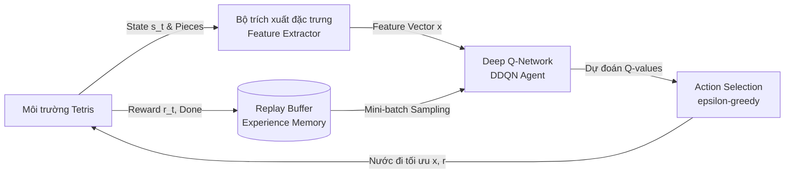

# ĐỀ CƯƠNG DỰ ÁN (PROJECT PROPOSAL)
## MÔN HỌC: REINFORCEMENT LEARNING (HỌC TĂNG CƯỜNG)

---

### **TÊN ĐỀ TÀI:**
### **NGHIÊN CỨU VÀ ỨNG DỤNG HỌC TĂNG CƯỜNG (REINFORCEMENT LEARNING) TRONG HUẤN LUYỆN AI TỰ ĐỘNG CHƠI GAME TETRIS**

* **Sinh viên thực hiện:** [Họ và tên sinh viên]
* **Mã số sinh viên (MSSV):** [MSSV]
* **Giảng viên hướng dẫn:** [Tên giảng viên]
* **Thời gian thực hiện:** Học kỳ [HK...] / Năm học [202...-202...]

---

## 1. TỔNG QUAN & ĐẶT VẤN ĐỀ (INTRODUCTION & MOTIVATION)

### 1.1. Bối cảnh
Game Tetris (Xếp gạch) được phát minh năm 1984 bởi Alexey Pajitnov, là một trong những tựa game kinh điển và phổ biến nhất trong lịch sử ngành trò chơi điện tử. Về mặt khoa học máy tính và toán học, Tetris đã được chứng minh là bài toán thuộc lớp **NP-Complete** (Demaine et al., 2002), do không gian trạng thái cực kỳ lớn kết hợp với tính bất định ngẫu nhiên (stochastic) từ chuỗi tetrominoes xuất hiện.

Trong lĩnh vực Trí tuệ nhân tạo (AI) và cụ thể là **Học tăng cường (Reinforcement Learning - RL)**, Tetris được coi là một môi trường thử thách tiêu chuẩn (benchmark environment) nhằm đánh giá khả năng:
* **Lập kế hoạch dài hạn (Long-term planning):** Mỗi quyết định đặt gạch ở hiện tại sẽ ảnh hưởng trực tiếp đến cấu trúc bề mặt trong hàng chục bước tiếp theo.
* **Xử lý sự đánh đổi tức thời và rủi ro (Risk-Reward Tradeoff):** Quyết định chờ đợi tạo combo 4 hàng (Tetris) để tối đa hóa điểm số hay dọn dẹp an toàn từng hàng để duy trì sự sống.
* **Cân bằng Exploration - Exploitation:** Khám phá các thế cờ mới và khai thác các chiến thuật đặt gạch đã được chứng minh hiệu quả.

### 1.2. Lý do chọn đề tài
Mặc dù đã có nhiều nghiên cứu áp dụng các phương pháp tối ưu hóa cổ điển (như thuật toán di truyền Genetic Algorithm hay heuristic của Pierre Dellacherie), việc ứng dụng các thuật toán **Học tăng cường sâu (Deep Reinforcement Learning - DRL)** như Deep Q-Network (DQN), Double DQN hay PPO (Proximal Policy Optimization) mang lại góc nhìn hiện đại:
1. Đánh giá khả năng học chính sách (policy) tự thích ứng từ trạng thái môi trường.
2. Thử nghiệm kỹ thuật **Feature Engineering** kết hợp mạng nơ-ron để tăng tốc độ hội tụ của mô hình.
3. Tích hợp mô hình AI sau khi huấn luyện vào giao diện trực quan trực quan hóa kết quả theo thời gian thực (Real-time AI Visualizer).

---

## 2. MỤC TIÊU NGHIÊN CỨU (PROJECT OBJECTIVES)

1. **Về mặt môi trường (Environment Simulation):**
   * Xây dựng hoặc tùy biến môi trường Tetris tuân thủ giao thức chuẩn **Gymnasium / Gym API** (`reset()`, `step()`, `render()`).
   * Hỗ trợ 2 chế độ hành động: *Step-by-step action* (trái, phải, xoay, rơi) và *Placement-based action* (chọn trực tiếp vị trí cột $x$ và góc xoay $r$).

2. **Về mô hình RL (Reinforcement Learning Modeling):**
   * Thiết lập bài toán Tetris dưới dạng **Markov Decision Process (MDP)**: Định nghĩa không gian trạng thái (State Space), không gian hành động (Action Space) và hàm thưởng (Reward Function).
   * Cài đặt và thực nghiệm các thuật toán cốt lõi:
     * **Baseline:** Heuristic Agent (Dellacherie Algorithm / Greedy Heuristic).
     * **Thuật toán chính:** **Deep Q-Network (DQN)** cải tiến với **Double DQN (DDQN)** và **Experience Replay**.
     * **Mở rộng (Nâng cao):** **Dueling DQN** hoặc **PPO (Policy Gradient)** nếu thời gian cho phép.

3. **Về đánh giá và trực quan hóa (Evaluation & Deployment):**
   * Theo dõi và phân tích các chỉ số: Số hàng ăn trung bình (Average Cleared Lines), Điểm số trung bình (Mean Score), Tỷ lệ số ván sống sót qua 10,000 bước.
   * Kết nối mô hình đã huấn luyện (pre-trained checkpoint) với giao diện web/visualizer để quan sát trực tiếp AI tự động đưa ra quyết định.

---

## 3. MÔ HÌNH HÓA TOÁN HỌC (MDP FORMALIZATION)

Bài toán được định nghĩa dưới dạng một quá trình quyết định Markov hữu hạn $\mathcal{M} = \langle \mathcal{S}, \mathcal{A}, \mathcal{P}, \mathcal{R}, \gamma \rangle$:

### 3.1. Không gian trạng thái (State Space $\mathcal{S}$)
Nhằm tối ưu hóa tốc độ hội tụ (sample efficiency), thay vì sử dụng toàn bộ pixel thô của màn hình ($20 \times 10$ binary grid), đề tài đề xuất biểu diễn trạng thái qua **Vector đặc trưng hình học (Handcrafted Geometric Features)** của bề mặt bàn cờ sau mỗi nước đi dự kiến:

$$s_t = \left[ f_1, f_2, f_3, f_4 \right]^T$$

Trong đó:
1. **$f_1$ - Tổng chiều cao các cột (Aggregate Height):**
   $$\text{AggHeight} = \sum_{c=1}^{10} h_c$$
   *(với $h_c$ là vị trí hàng cao nhất có khối gạch ở cột $c$)*
2. **$f_2$ - Số lượng lỗ rỗng (Number of Holes):**
   $$\text{Holes} = \sum_{c=1}^{10} \sum_{r=1}^{h_c} \mathbb{I}(\text{grid}[r][c] == 0)$$
   *(các ô trống bị khối gạch khác che phủ phía trên, rất khó lấp đầy)*
3. **$f_3$ - Độ mấp mô bề mặt (Bumpiness):**
   $$\text{Bumpiness} = \sum_{c=1}^{9} |h_c - h_{c+1}|$$
   *(đo lường độ gồ ghề giữa các cột cạnh nhau, bề mặt càng phẳng càng dễ đặt gạch)*
4. **$f_4$ - Số hàng dọn sạch ngay lập tức (Cleared Lines):**
   $$\text{Lines} \in \{0, 1, 2, 3, 4\}$$

> *Ghi chú:* Cách tiếp cận State Representation này đã được chứng minh đạt hiệu năng vượt trội trong các nghiên cứu kinh điển về Tetris (Yiyuan Lee et al., Thiery & Scherrer).

### 3.2. Không gian hành động (Action Space $\mathcal{A}$)
Sử dụng **Placement-based Action Space**:
* Với mỗi khối gạch $T$ hiện tại, xét tất cả các cặp hợp lệ $(x, r)$, trong đó:
  * $r \in \{0^\circ, 90^\circ, 180^\circ, 270^\circ\}$ (số hướng xoay khả dĩ tùy hình dạng khối, ví dụ khối 'O' có 1 hướng, khối 'I' có 2 hướng, khối 'T' có 4 hướng).
  * $x \in [0, 10 - \text{width}(T, r)]$ (vị trí cột thả xuống).
* Tác tử (Agent) duyệt qua tập hợp các hành động khả dĩ $\mathcal{A}(s_t)$, dự đoán giá trị $Q(s_{t+1}, a)$ tương ứng với trạng thái bàn cờ tương lai và chọn hành động tối ưu:
  $$a^* = \arg\max_{a \in \mathcal{A}(s_t)} Q(s'(s_t, a))$$

### 3.3. Hàm thưởng (Reward Function $\mathcal{R}$)
Hàm thưởng được thiết kế nhằm khuyến khích ăn nhiều hàng đồng thời phạt nặng các cấu trúc bất lợi:

$$\mathcal{R}(s, a, s') = w_1 \cdot \text{Lines}(s')^2 - w_2 \cdot \Delta \text{Holes} - w_3 \cdot \Delta \text{Bumpiness} - w_4 \cdot \Delta \text{AggHeight} + r_{\text{alive}}$$

* **Thưởng ăn hàng ($w_1 \cdot \text{Lines}^2$):** Sử dụng hàm bình phương để khuyến khích AI ăn nhiều hàng cùng lúc (Tetris 4 hàng cho điểm đột biến).
* **Phạt tạo lỗ rỗng ($-w_2 \cdot \Delta \text{Holes}$):** Phạt nặng khi nước đi tạo ra hốc kẹt.
* **Phạt độ gồ ghề ($-w_3 \cdot \Delta \text{Bumpiness}$):** Khuyến khích giữ bề mặt phẳng đều.
* **Phạt chiều cao ($-w_4 \cdot \Delta \text{AggHeight}$):** Giữ độ cao bàn cờ ở mức an toàn.
* **Thưởng sống sót ($r_{\text{alive}} = +1$ / bước):** Khuyến khích duy trì lượt chơi dài.
* **Phạt thua cuộc ($r_{\text{terminal}} = -100$):** Khi khối chạm nóc màn hình.

---

## 4. PHƯƠNG PHÁP & THUẬT TOÁN (METHODOLOGY)

### 4.1. Deep Q-Network (DQN) & Double DQN (DDQN)
* **Kiến trúc mạng (Neural Network Architecture):**
  * **Input:** Vector đặc trưng 4 chiều $[f_1, f_2, f_3, f_4]$ của trạng thái sau khi thực hiện hành động.
  * **Hidden Layers:** Mạng Fully Connected (MLP) gồm 2 lớp ẩn (64 units $\rightarrow$ 64 units) với hàm kích hoạt ReLU.
  * **Output:** Dự đoán giá trị kỳ vọng tích lũy $Q(s')$.
* **Cơ chế ổn định huấn luyện:**
  * **Experience Replay Buffer:** Lưu trữ các bộ chuyển đổi $(s, a, r, s', \text{done})$ dung lượng $30,000$ mẫu, lấy mẫu ngẫu nhiên (mini-batch size = 512) để phá vỡ tính tương quan thời gian giữa các mẫu.
  * **Target Network:** Sử dụng mạng mục tiêu riêng biệt $\theta^-$ được cập nhật chậm (soft update hoặc sau mỗi $C$ epochs) để tránh dao động phân kỳ trong hàm mất mát Bellman:
    $$y_i = r + \gamma \max_{a'} Q(s', a'; \theta^-)$$
    $$\mathcal{L}(\theta) = \mathbb{E}\left[ (y_i - Q(s, a; \theta))^2 \right]$$
  * **Chính sách $\epsilon$-greedy:** Tỷ lệ $\epsilon$ giảm dần từ $1.0 \rightarrow 0.001$ qua $2,000$ episodes đầu tiên để cân bằng giữa học ngẫu nhiên và khai thác tri thức.

---

## 5. CÔNG NGHỆ & CÔNG CỤ SỬ DỤNG (TECH STACK)

| Thành phần | Công nghệ / Thư viện | Mục đích |
| :--- | :--- | :--- |
| **Ngôn ngữ chính** | Python 3.10+ | Lập trình huấn luyện mô hình RL |
| **Framework RL/DL** | PyTorch / Gymnasium | Xây dựng mạng nơ-ron, tính gradient và mô phỏng môi trường |
| **Tính toán ma trận** | NumPy, SciPy | Xử lý ma trận bàn cờ $20 \times 10$, tính toán thuộc tính hình học |
| **Quản lý & Trực quan** | TensorBoard / Matplotlib | Vẽ biểu đồ loss, learning curve, điểm số qua từng epoch |
| **Giao diện game (UI)** | HTML5, Canvas, JavaScript | Giao diện Cyber Tetris hiện đại để demo và trực quan hóa tương tác |
| **Lưu trữ Model** | PyTorch Checkpoint (`.pth`) / ONNX | Xuất mô hình để suy luận (Inference) tốc độ cao |

---

## 6. KẾ HOẠCH TRIỂN KHAI & TIẾN ĐỘ DỰ KIẾN (TIMELINE & MILESTONES)

Dự án dự kiến thực hiện trong vòng **6 tuần**:

| Tuần | Nội dung công việc | Đầu ra kỳ vọng (Deliverables) |
| :---: | :--- | :--- |
| **Tuần 1** | - Nghiên cứu tài liệu tổng quan (Literature Review). - Hoàn thiện môi trường Tetris chuẩn Gym API trong Python. | File mã nguồn môi trường `tetris_env.py` hoàn chỉnh, kiểm thử không có lỗi logic. |
| **Tuần 2** | - Cài đặt bộ trích xuất đặc trưng (Feature Extractor: Height, Holes, Bumpiness). - Xây dựng thuật toán Baseline Heuristic (Dellacherie) để làm mốc đối chứng. | Baseline Agent đạt trung bình 500 - 1,000 hàng dọn sạch. |
| **Tuần 3** | - Cài đặt kiến trúc Deep Q-Network (DQN) & Double DQN (PyTorch). - Xây dựng Replay Buffer và hàm loss Huber / MSE. | Module `model.py` và `agent.py` hoàn thiện. |
| **Tuần 4** | - Huấn luyện mô hình quy mô lớn (5,000 - 10,000 episodes). - Tinh chỉnh siêu tham số (Learning rate, Discount factor $\gamma$, Reward weights $w_i$). | Nhật ký huấn luyện trên TensorBoard; đồ thị phần thưởng có xu hướng hội tụ rõ rệt. |
| **Tuần 5** | - Đánh giá mô hình (Evaluation & Benchmarking). - So sánh hiệu quả giữa DQN thuần, Double DQN và Baseline Heuristic. | Bảng số liệu đối sánh chi tiết (Score, Cleared Lines, Survival time). |
| **Tuần 6** | - Kết nối mô hình với giao diện trực quan (Visualizer Demo). - Viết báo cáo tổng kết hoàn chỉnh (Final Report) và slide thuyết trình. | Video demo, Báo cáo đồ án PDF và Mã nguồn GitHub hoàn chỉnh. |

---

## 7. TIÊU CHÍ ĐÁNH GIÁ KẾT QUẢ (EVALUATION METRICS)

1. **Hiệu suất chơi (Gameplay Performance):**
   * **Số hàng dọn sạch trung bình (Mean Cleared Lines):** Mục tiêu AI dọn sạch $\ge 1,000$ hàng/ván chơi sau khi huấn luyện.
   * **Điểm số tối đa và trung bình (Max & Mean Score):** So sánh với mốc chơi của con người mức trung bình/khá.
   * **Tuổi thọ trung bình (Average Survival Steps):** Số bước đi tối đa trước khi xảy ra va chạm chạm nóc (Terminal state).

2. **Khả năng hội tụ thuật toán (Learning Efficiency):**
   * Tốc độ suy giảm của hàm tổn thất Loss function.
   * Mức độ ổn định của chính sách (Policy stability) - tránh hiện tượng policy collapse khi số episode tăng cao.

3. **Tính ứng dụng & Demo:**
   * AI có khả năng thực hiện suy luận thời gian thực (inference time $< 15$ ms/bước).
   * Giao diện trực quan thể hiện rõ ràng các thao tác của AI và các chỉ số thống kê trực tiếp.

---

## 8. TÀI LIỆU THAM KHẢO CHÍNH (REFERENCES)

1. **Mnih, V., Kavukcuoglu, K., Silver, D., et al. (2015).** *Human-level control through deep reinforcement learning.* Nature, 518(7540), 529-533.
2. **Thiery, C., & Scherrer, B. (2009).** *Building Controllers for Tetris: The Very Simple Approach Might Be the Best.* In Proceedings of the 2009 International Conference on Advances in Computer Games (ACG 12).
3. **Fahey, C. (2003).** *Tetris AI, Computer plays Tetris.* Colin Fahey's Comprehensive Research on Tetris heuristics and genetic algorithms.
4. **Demaine, E. D., Hohenberger, S., & Liben-Nowell, D. (2002).** *Tetris is Hard, Even to Approximate.* International Computing and Combinatorics Conference (COCOON).
5. **Van Hasselt, H., Guez, A., & Silver, D. (2016).** *Deep Reinforcement Learning with Double Q-learning.* In Proceedings of the AAAI Conference on Artificial Intelligence (Vol. 30, No. 1).
6. **Sutton, R. S., & Barto, A. G. (2018).** *Reinforcement Learning: An Introduction.* MIT Press, Cambridge, MA.

---
*(Đề cương được lập và đệ trình phục vụ đánh giá tiến độ môn học Reinforcement Learning)*
