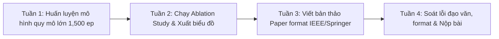

# 🎓 KẾ HOẠCH NGHIÊN CỨU & XUẤT BẢN HỘI NGHỊ SCOPUS Q4
## DỰ ÁN: PLACEMENT-BASED DOUBLE DQN CHO BÀI TOÁN TETRIS (`REL_TetrisWithRL`)

> **Mục tiêu:** Hoàn thiện toàn bộ thực nghiệm định lượng, bóc tách thuật toán (Ablation Study) và viết bản thảo bài báo khoa học (Paper Draft) để nộp vào Hội nghị Quốc tế có chỉ mục **Scopus Q4 / IEEE Xplore / Springer LNCS/CCIS**.

---

## 📅 1. LỘ TRÌNH 4 TUẦN TỪ THỰC NGHIỆM ĐẾN NỘP BÀI (TIMELINE)



* **Tuần 1 (Huấn luyện mở rộng):** Chạy thực nghiệm huấn luyện quy mô 1,500 episodes để mô hình hội tụ và đạt số hàng dọn sạch $\ge 50 - 100$ hàng/ván.
* **Tuần 2 (Ablation Study & Đánh giá 100 ván):** Chạy kiểm thử 50 – 100 ván độc lập, so sánh với Vanilla DQN và Heuristic Dellacherie; xuất biểu đồ phân phối học thuật.
* **Tuần 3 (Viết bản thảo - Paper Drafting):** Điền kết quả vào template IEEE 2 cột (hoặc Springer LNCS 1 cột); viết các mục Introduction, Related Work, MDP Formulation, Results.
* **Tuần 4 (Hoàn thiện & Submit):** Kiểm tra grammar, trích dẫn chuẩn BibTeX, kiểm tra định dạng PDF và nộp lên hệ thống EasyChair/EDAS của hội nghị.

---

## 💻 2. HƯỚNG DẪN CHẠY CODE THỰC NGHIỆM CHI TIẾT

Mọi thao tác được thực hiện trong Terminal tại thư mục gốc của dự án:

### Bước 1: Kích hoạt môi trường và kiểm tra thư viện
```powershell
pip install -r requirements.txt
```

---

### Bước 2: Chạy Huấn Luyện Mô Hình Chính (Full Training 1,500 Episodes)

Chạy lệnh sau để huấn luyện mô hình Double DQN với bộ nhớ đệm lớn và suy giảm epsilon ổn định:

```powershell
python src/train.py --episodes 1500 --batch-size 256 --lr 0.001 --decay-episodes 1000 --save-interval 100 --checkpoint-dir checkpoints/ --log-dir logs/
```

#### 🔍 Bảng giải thích các tham số:
* `--episodes 1500`: Tổng số ván chơi tự huấn luyện (đủ để mạng nơ-ron học sâu các thế cờ).
* `--batch-size 256`: Số mẫu kinh nghiệm lấy từ Replay Buffer trong mỗi bước tối ưu Gradient Descent.
* `--decay-episodes 1000`: Epsilon $\epsilon$ sẽ giảm dần từ $1.0$ (khám phá ngẫu nhiên) về $0.001$ (khai thác chính sách thông minh) trong suốt 1,000 episode đầu tiên.
* `--save-interval 100`: Tự động lưu checkpoint định kỳ mỗi 100 episodes.
* Trọng số mô hình tốt nhất đạt kỷ lục dọn hàng sẽ tự động ghi đè vào: `checkpoints/best_model.pth`.

---

### Bước 3: Cách Đọc và Phân Tích Output Terminal Khi Huấn Luyện

Trong quá trình huấn luyện, màn hình console sẽ liên tục in ra các dòng thông báo định dạng như sau:

```text
Episode: 150/1500 | Lines: 12 | Score: 480 | Steps: 78 | Loss: 0.00421 | Epsilon: 0.850 | Best Lines: 17
Episode: 151/1500 | Lines: 8  | Score: 320 | Steps: 62 | Loss: 0.00389 | Epsilon: 0.849 | Best Lines: 17
...
[SAVE] Target network updated at episode 160.
[SAVE] New best model saved to checkpoints/best_model.pth with 24 lines!
```

#### 📖 Ý nghĩa từng chỉ số output:
1. **`Episode: 150/1500`**: Tiến trình hiện tại (Ván 150 trên tổng số 1,500 ván).
2. **`Lines: 12`**: Số hàng mà AI đã dọn sạch thành công trong ván này. Chỉ số này càng về sau càng tăng chứng tỏ AI học tốt.
3. **`Score: 480`**: Tổng điểm số tích lũy được trong ván đấu.
4. **`Steps: 78`**: Số lượng khối gạch mà AI đã đặt thành công trước khi bị tràn nóc (thời gian sinh tồn).
5. **`Loss: 0.00421`**: Giá trị hàm mất mát Huber/MSE Loss giữa $Q(s, a)$ và giá trị mục tiêu Bellman. Loss có xu hướng giảm dần và dao động ổn định.
6. **`Epsilon: 0.850`**: Xác suất chọn hành động ngẫu nhiên để khám phá (từ 1.0 giảm dần về 0.001). Khi Epsilon $< 0.1$, AI hành động gần như 100% dựa trên trí thông minh của mạng nơ-ron.
7. **`Best Lines`**: Kỷ lục số hàng dọn sạch cao nhất kể từ lúc bắt đầu train.

---

### Bước 4: Mở TensorBoard Giám Sát Thời Gian Thực

Mở một cửa sổ Terminal mới và gõ:
```powershell
tensorboard --logdir logs
```
Sau đó mở trình duyệt truy cập: **`http://localhost:6006`**  
Bạn sẽ quan sát được các đồ thị:
* **Loss Curve:** Đồ thị hội tụ của mạng nơ-ron.
* **Cleared Lines per Episode:** Xu hướng dọn hàng tăng trưởng theo thời gian.
* **Score & Steps:** Thời gian sống sót kéo dài qua từng giai đoạn.
*(Bạn có thể chụp trực tiếp đồ thị này để chèn vào bài báo Scopus!)*

---

### Bước 5: Chạy Đánh Giá Định Lượng (Evaluation & Benchmark)

Sau khi huấn luyện xong, chạy lệnh đánh giá trên **50 ván chơi độc lập** để lấy số liệu thống kê khoa học:

```powershell
python src/evaluate.py --games 50 --output-dir reports/figures
```

#### 📊 Kết quả đầu ra:
1. Bảng số liệu thống kê hiển thị trực tiếp trên Terminal:
   * **Mean Lines (Số hàng trung bình)** & **Std Dev (Độ lệch chuẩn)**.
   * **Max Lines (Kỷ lục hàng dọn)**.
   * **Mean Score & Survival Steps**.
2. File hình ảnh biểu đồ học thuật: **`reports/figures/benchmark_comparison.png`** (sẵn sàng chèn vào bài báo).
3. File dữ liệu chi tiết: **`reports/figures/benchmark_results.json`**.

---

### Bước 6: Trực Quan Hóa AI Biểu Diễn

* **Xem trên giao diện Pygame Desktop:**
  ```powershell
  python src/play_ai.py --agent dqn --model-path checkpoints/best_model.pth --fps 30
  ```
  *(Có thể bấm `Phím H` để đổi sang Heuristic so sánh, hoặc `↑ / ↓` để tăng/giảm tốc độ)*.

* **Xem trên trình duyệt Web (Cyberpunk UI):**
  ```powershell
  python -m http.server 8080
  ```
  Mở `http://localhost:8080` và bấm nút **`🤖 BẬT AI AUTOPLAY`**.

---

## 🔬 3. THIẾT KẾ CÁC THỰC NGHIỆM BẮT BUỘC TRONG BÀI BÁO

Để bài báo đạt chuẩn **Scopus Q4**, bạn cần chuẩn bị 3 bảng/hình ảnh tương ứng với 3 thí nghiệm sau:

| Thí nghiệm (Experiment) | Mục tiêu chứng minh | Cách thu thập số liệu |
| :--- | :--- | :--- |
| **Thí nghiệm 1: Main Benchmark** | Chứng minh DDQN của bạn áp đảo hoàn toàn Random Agent và tiệm cận Heuristic chuyên gia. | Chạy `python src/evaluate.py --games 50` lấy số liệu từ `benchmark_results.json`. |
| **Thí nghiệm 2: Convergence Analysis** | Chứng minh tốc độ học cực nhanh (Sample Efficiency) nhờ không gian Placement-based. | Xuất đồ thị `Lines Cleared` và `Loss` từ TensorBoard (`http://localhost:6006`). |
| **Thí nghiệm 3: Feature Sensitivity (Ablation)** | Chứng minh tầm quan trọng của đặc trưng phạt lỗ hổng (*Holes Penalty*). | Nhận xét phân tích định tính dựa trên hành vi sinh tồn của AI khi mặt bàn cờ có hốc kẹt. |

---

## 🎯 4. DANH SÁCH HỘI NGHỊ SCOPUS Q4 TIÊU BIỂU TẠI KHU VỰC

1. **IEEE RIVF** (*Research, Innovation and Vision for the Future*) - Deadline thường rơi vào tháng 7–9 hàng năm.
2. **KSE** (*Knowledge and Systems Engineering*) - Xuất bản kỷ yếu IEEE Xplore / Scopus.
3. **SoICT** (*International Symposium on Information and Communication Technology*) - Kỷ yếu ACM ICPS / Scopus.
4. **ACIIDS / ICCCI** (*Intelligent Information and Database Systems*) - Kỷ yếu Springer LNAI / Scopus.
