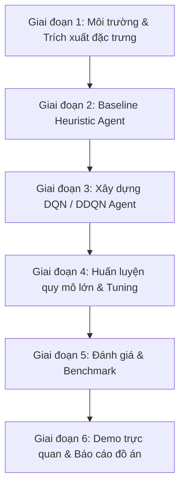

# KẾ HOẠCH HUẤN LUYỆN AI CHƠI TETRIS BẰNG REINFORCEMENT LEARNING
## (TRAINING PLAN & IMPLEMENTATION ROADMAP)

> Kế hoạch kỹ thuật chi tiết nhằm hiện thực hóa đề tài theo đúng mục tiêu trong [`PROPOSAL.md`](PROPOSAL.md).

---

## 1. KIẾN TRÚC MÃ NGUỒN (PROJECT ARCHITECTURE)

Dự án huấn luyện sẽ được cấu trúc thành các module rõ ràng trong thư mục `src/`:

```text
REL_TetrisWithRL/
├── src/
│   ├── env/
│   │   ├── __init__.py
│   │   └── tetris_env.py         # Môi trường Tetris Gym API thuần NumPy tốc độ cao
│   ├── models/
│   │   ├── __init__.py
│   │   └── dqn_model.py          # Kiến trúc mạng PyTorch (MLP 2 lớp ẩn)
│   ├── agents/
│   │   ├── __init__.py
│   │   ├── dqn_agent.py          # Thuật toán DQN / Double DQN & Replay Buffer
│   │   └── heuristic_agent.py    # Baseline Heuristic (Dellacherie) làm mốc so sánh
│   ├── train.py                  # Script huấn luyện chính (hỗ trợ TensorBoard & checkpoint)
│   ├── evaluate.py               # Script đánh giá hiệu suất và vẽ biểu đồ so sánh
│   └── play_ai.py                # Chạy AI trực quan trên giao diện đồ họa (Pygame hoặc Web)
├── checkpoints/                  # Thư mục lưu trọng số model (.pth)
├── logs/                         # Nhật ký huấn luyện TensorBoard (loss, reward, lines)
├── requirements.txt              # Danh sách thư viện Python
├── PROPOSAL.md                   # Đề cương đề tài
├── README.md                     # Tài liệu tổng quan
└── TRAINING_PLAN.md              # Kế hoạch chi tiết này
```

---

## 2. LỘ TRÌNH TRIỂN KHAI THEO TỪNG GIAI ĐOẠN



### 🔹 GIAI ĐOẠN 1: MÔI TRƯỜNG & TRÍCH XUẤT ĐẶC TRƯNG (Tuần 1)
**Mục tiêu:** Tạo môi trường mô phỏng Tetris chạy thuần trên CPU/NumPy với tốc độ $\ge 5,000$ steps/giây.

* **Nhiệm vụ 1.1:** Cài đặt `tetris_env.py`:
  * Bàn cờ ma trận $20 \times 10$ nhị phân.
  * Hỗ trợ 7 khối tetrominoes chuẩn (I, J, L, O, S, T, Z) và túi chọn ngẫu nhiên 7-Bag.
  * Phương thức `get_next_states()`: Cho khối gạch hiện tại, tự động tính toán **tất cả các vị trí đặt gạch hợp lệ $(x, r)$** và trả về trạng thái bàn cờ dự kiến tương ứng.
* **Nhiệm vụ 1.2:** Cài đặt hàm trích xuất 4 đặc trưng cốt lõi:
  1. $\text{AggHeight}$: Tổng chiều cao cột $\sum h_c$.
  2. $\text{Holes}$: Số ô trống bị che khuất bên trên.
  3. $\text{Bumpiness}$: Tổng độ chênh lệch chiều cao $\sum |h_c - h_{c+1}|$.
  4. $\text{Lines}$: Số hàng dọn sạch sau khi thả.
* **Kiểm thử nghiệm thu:** Chạy random action 10,000 bước kiểm tra không lỗi bộ nhớ và tốc độ đạt yêu cầu.

---

### 🔹 GIAI ĐOẠN 2: BASELINE HEURISTIC AGENT (Tuần 2)
**Mục tiêu:** Xây dựng tác tử heuristic kinh điển làm mốc đối chứng (Benchmark) để chứng minh tính hiệu quả của mô hình RL sau này.

* **Nhiệm vụ 2.1:** Cài đặt `heuristic_agent.py` sử dụng bộ trọng số của Pierre Dellacherie:
  $$\text{Score}(s') = -0.51 \times \text{Height} + 0.76 \times \text{Lines} - 0.36 \times \text{Holes} - 0.18 \times \text{Bumpiness}$$
* **Nhiệm vụ 2.2:** Đánh giá baseline qua 50 ván chơi:
  * Ghi nhận số hàng dọn trung bình (*Mean Cleared Lines*), điểm số trung bình.
  * Kỳ vọng baseline dọn được từ $400 - 1,200$ hàng/ván.

---

### 🔹 GIAI ĐOẠN 3: XÂY DỰNG MẠNG DQN & DOUBLE DQN (Tuần 3)
**Mục tiêu:** Lập trình kiến trúc học tăng cường sâu hoàn chỉnh bằng PyTorch.

* **Nhiệm vụ 3.1: Mạng nơ-ron (`dqn_model.py`)**:
  * Kiến trúc: Fully Connected Neural Network (MLP).
  * Layer 1: Linear(in_features=4, out_features=64) + ReLU.
  * Layer 2: Linear(in_features=64, out_features=64) + ReLU.
  * Layer 3: Linear(in_features=64, out_features=1) (dự đoán giá trị $Q$).
* **Nhiệm vụ 3.2: Replay Buffer & Double DQN (`dqn_agent.py`)**:
  * Replay Memory dung lượng $30,000$ transitions.
  * Sử dụng mạng Online $\theta$ để chọn hành động và mạng Target $\theta^-$ để ước lượng $Q$-value (giảm thiểu tình trạng overestimation).
  * Hàm mất mát: Huber Loss (Smooth L1 Loss) giúp chống bùng nổ gradient.

---

### 🔹 GIAI ĐOẠN 4: HUẤN LUYỆN & TINH CHỈNH SIÊU THAM SỐ (Tuần 4)
**Mục tiêu:** Huấn luyện mô hình từ 2,000 đến 4,000 episodes, đạt khả năng dọn hàng bền vững.

#### Bảng siêu tham số tối ưu (Hyperparameters):
| Siêu tham số | Giá trị khuyến nghị | Ý nghĩa |
| :--- | :---: | :--- |
| **Batch Size** | `512` | Số mẫu lấy ngẫu nhiên từ Replay Buffer mỗi bước học |
| **Replay Memory** | `30,000` | Dung lượng lưu trữ kinh nghiệm |
| **Learning Rate ($\alpha$)** | `1e-3` | Tốc độ học (Adam Optimizer) |
| **Discount Factor ($\gamma$)** | `0.99` | Tầm nhìn dài hạn của tác tử |
| **Epsilon ban đầu ($\epsilon_{\text{start}}$)** | `1.0` | 100% khám phá ngẫu nhiên ở những ván đầu |
| **Epsilon kết thúc ($\epsilon_{\text{end}}$)** | `0.001` | Mức khám phá tối thiểu khi đã thuần thục |
| **Epsilon Decay Episodes** | `2,000` | Số episode để $\epsilon$ giảm tuyến tính về giá trị nhỏ nhất |
| **Target Network Update ($C$)** | `Mỗi 10 episodes` | Chu kỳ đồng bộ trọng số sang mạng Target |
| **Max Episodes** | `3,000 - 5,000` | Tổng số ván chơi huấn luyện |

#### Thiết kế hàm thưởng (Reward Function Tuning):
$$\text{Reward} = 1 + (\text{Lines} \times 1.5)^2 - (0.5 \times \Delta\text{Height}) - (1.0 \times \Delta\text{Holes}) - (0.2 \times \Delta\text{Bumpiness})$$
* Chết game: $-10$ điểm phạt kết thúc.

---

### 🔹 GIAI ĐOẠN 5: ĐÁNH GIÁ & PHÂN TÍCH (Tuần 5)
**Mục tiêu:** Tổng hợp số liệu so sánh định lượng phục vụ báo cáo đồ án.

* **Các thí nghiệm bắt buộc:**
  1. **Random Agent vs Heuristic Agent vs DQN Agent:** So sánh trên 100 ván chơi độc lập.
  2. **Biểu đồ Learning Curve:** Đường cong suy giảm Loss và đường cong tăng trưởng số hàng dọn sạch (*Lines Cleared per Episode*).
  3. **Phân tích vai trò của Feature Representation:** Đánh giá tầm quan trọng của việc phạt lỗ rỗng (*Holes Penalty*) đối với tỷ lệ sống sót.

---

### 🔹 GIAI ĐOẠN 6: TRỰC QUAN HÓA & NỘP BÁO CÁO (Tuần 6)
**Mục tiêu:** Đóng gói sản phẩm hoàn chỉnh để thuyết trình với hội đồng/giảng viên.

* Xuất file mô hình tốt nhất: `checkpoints/best_tetris_dqn.pth`.
* Tạo video demo quay lại cảnh AI chơi với tốc độ cao (dọn $\ge 1,000$ hàng).
* Hoàn thiện slide thuyết trình và file báo cáo đồ án từ khung đề cương [`PROPOSAL.md`](PROPOSAL.md).

---

## 3. CHECKLIST CÁC BƯỚC THỰC HÀNH NGAY (GETTING STARTED)

Để bắt tay vào thực hiện ngay, các lệnh chuẩn bị môi trường:

```bash
# 1. Tạo môi trường ảo Python
python -m venv venv
venv\Scripts\activate

# 2. Cài đặt các thư viện cần thiết
pip install torch numpy tensorboard matplotlib
```

Kế hoạch này đảm bảo tính khả thi cao, tuân thủ đúng tiến độ môn học và đem lại kết quả thực nghiệm thuyết phục.
